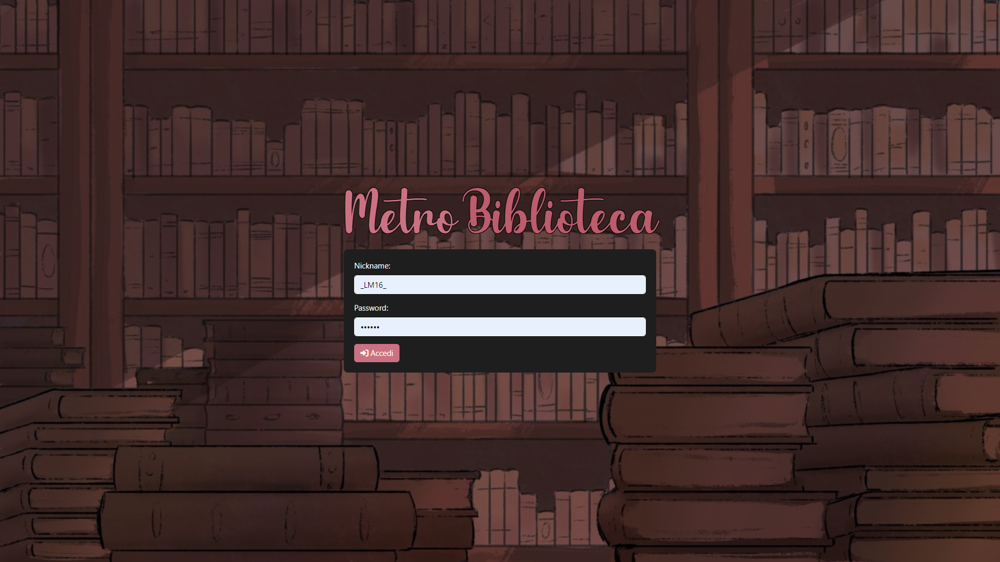
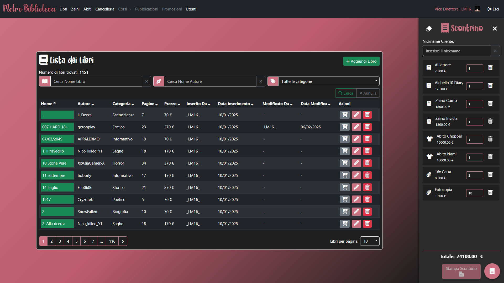
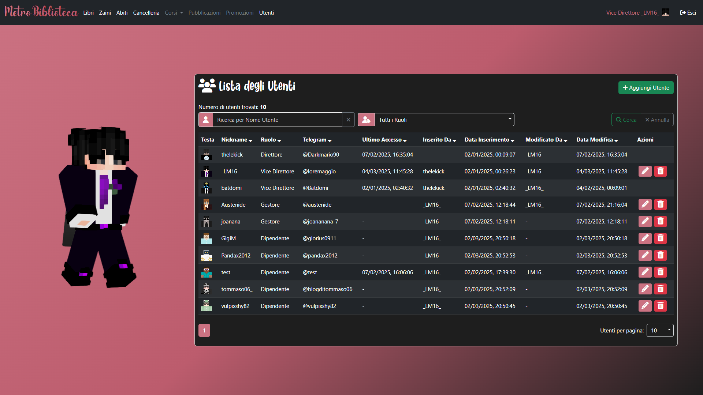

# 📚 Metro Biblioteca


## 🔍 Descrizione del Progetto

Metro Biblioteca è una piattaforma web per la gestione di una biblioteca digitale. L'applicazione permette di gestire libri, utenti, zaini, abiti, cancelleria e scontrini.



## ✨ Funzionalità Principali

- 📖 **Gestione Libri**: Catalogazione di libri con diverse categorie (Avventura, Manga, Fantasy, Fantascienza, Romantico, ecc.)
- 👥 **Gestione Utenti**: Registrazione, autenticazione e gestione dei privilegi degli utenti
- 🎒 **Gestione Zaini**: Catalogazione e gestione di zaini
- 👔 **Gestione Abiti**: Catalogazione e gestione di abiti
- 📏 **Gestione Cancelleria**: Catalogazione e gestione di articoli di cancelleria
- 🧾 **Gestione Scontrini**: Generazione e gestione di scontrini per le transazioni





## 💻 Requisiti di Sistema

- Node.js versione LTS consigliata, sviluppato con la **v20.16.0**
- Database SQL (MySQL/PostgreSQL)

## 🛠️ Tecnologie Utilizzate e Componenti del Progetto

- **Backend**: Sviluppato in Node.js con Express.js come framework per il web server.  
    
  

- **Database**: Gestione dei dati tramite SQL, utilizzando Sequelize come ORM.  
    
    
  

- **Autenticazione**: Implementata con Passport.js per una gestione sicura degli accessi.  
  

- **Frontend**: Interfaccia utente realizzata con il template engine EJS, arricchita da CSS e JavaScript.  
    
    
  

- **Strumenti Aggiuntivi**:  
  - *Express-session* per la gestione delle sessioni.  
    

  - *Connect-flash* per la visualizzazione di messaggi flash nelle interazioni utente.  
    

## 🚀 Installazione

1. Clona il repository

   ```bash
   git clone [URL_DEL_REPOSITORY]
   cd metro-biblioteca
   ```

2. Installa le dipendenze

   ```bash
   npm install
   ```

3. Configura il database
   - Assicurati che il tuo database SQL sia in esecuzione
   - Modifica le configurazioni di connessione in `models/index.js` se necessario

4. Avvia l'applicazione

   ```bash
   npm start
   ```

5. Accedi all'applicazione
   - Apri il browser e vai a `http://localhost:3000`

## 📂 Struttura del Progetto

```nodejs
metro-biblioteca/
├── controllers/  # Logica di controllo
├── models/       # Definizioni dei modelli Sequelize
├── routes/       # Definizioni delle rotte Express
├── views/        # Template EJS
├── public/       # File statici (CSS, JS, immagini)
├── database/     # Script SQL
└── app.js        # Entry point dell'applicazione
```

## 🤖 Bot Telegram Integrato

L'applicazione include un bot automatizzato (bot.js) che viene avviato insieme al server principale, facilitando alcune operazioni automatiche.

## 🗃️ Manutenzione del Database

- 📥 Per importare nuovi libri: utilizzare gli script nella cartella `database/import`
- 📤 Per esportare dati: utilizzare gli script nella cartella `database/export`

## 📄 Licenza

Consultare il file [LICENSE](LICENSE) per informazioni sulla licenza.

## ©️ Crediti

Sviluppato con ❤️ da  **[Lorenzo Maggiolo - LM16](https://github.com/lmaggiolo)**  
[](https://github.com/lmaggiolo)
